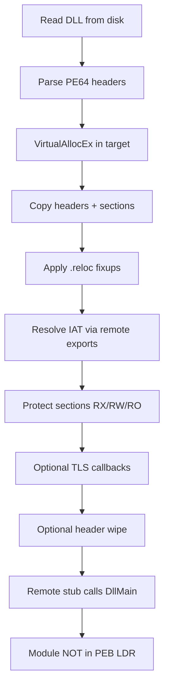

# injectorz

**Educational Windows x64 DLL Manual Map Injector** for anticheat research.

This project implements a complete user-mode manual mapper so an anticheat team can **simulate advanced injection attacks against their own game client**, study the resulting artifacts, and harden detection. It is intentionally documented at every stage with *what the code does*, *why the Windows loader does it*, and *how an anticheat can spot the anomaly*.

> **Responsible use:** Use only on software you own or are explicitly authorized to test (your game, your lab VMs). Unauthorized injection into third-party processes is illegal and unethical. This repository exists for defensive research.

---

## Manual mapping vs `LoadLibrary` injection

### Classic `LoadLibrary` injection

1. `OpenProcess` on the target.
2. `VirtualAllocEx` a buffer; `WriteProcessMemory` the DLL path string.
3. `CreateRemoteThread` starting at `LoadLibraryW` / `LoadLibraryA`.
4. The **real Windows loader** maps the image as `MEM_IMAGE`, applies relocations/imports/TLS, runs CRT init, calls `DllMain`, and inserts the module into the **PEB LDR** lists (`InLoadOrderModuleList`, etc.).

**Why cheats avoid it:** The DLL appears in every module enumeration API (`EnumProcessModules`, Toolhelp, `NtQueryVirtualMemory` with `MemoryMappedFilenameInformation`). Anticheats trivially blacklist unknown modules.

### Manual mapping

The injector **reimplements the relevant parts of the loader in user-mode**:

1. Read the DLL file locally and parse the PE.
2. Allocate anonymous memory in the target (`VirtualAllocEx` → typically `MEM_PRIVATE`).
3. Copy headers/sections, apply relocations, resolve the IAT, run TLS, call `DllMain`.
4. **Do not** register the module with the loader / PEB LDR.
5. Optionally wipe PE headers so signature scans miss `MZ` / `PE\0\0`.

**Result:** Executable code runs from a base address that **does not appear** in module lists and often has **no file backing**. That invisibility is exactly what modern anticheats hunt via memory / VAD / thread forensics.



---

## How this implementation works (step-by-step)

| Step | Code | Purpose |
|------|------|---------|
| CLI | `src/main.cpp` | `--pid` / `--process-name` + `--dll`, options for wipe/TLS/verbosity |
| Open target | `process_utils.cpp` | `OpenProcess` with VM + `CREATE_THREAD` rights |
| Parse PE | `pe_utils.cpp` | DOS/NT64, sections, RVA→file offset, data directories |
| Allocate | `manual_mapper.cpp` | Prefer `ImageBase`; else any base (then relocate) |
| Map sections | `manual_mapper.cpp` | Headers + each section’s raw bytes to VA |
| Relocate | `manual_mapper.cpp` | Walk `.reloc`, apply `IMAGE_REL_BASED_DIR64` |
| Imports | `manual_mapper.cpp` + `process_utils.cpp` | Find deps in target, parse export dirs via RPM, patch IAT |
| Protect | `manual_mapper.cpp` | Per-section `VirtualProtectEx` (avoid blanket RWX) |
| TLS | `manual_mapper.cpp` | Read relocated callback array; invoke each remotely |
| Stealth | `manual_mapper.cpp` | Zero `SizeOfHeaders`, optionally `PAGE_NOACCESS` |
| Execute | `manual_mapper.cpp` | Tiny x64 stub + `CreateRemoteThread` → `DllMain` |

### Bootstrap stub

`CreateRemoteThread` only passes one argument (`RCX`). `DllMain` needs `(hModule, reason, reserved)`. The injector writes a small position-independent stub that loads a descriptor and calls:

```text
function(hModule, DLL_PROCESS_ATTACH, nullptr)
```

The stub region is freed after the call; the mapped image remains.

---

## Detection vectors & anticheat recommendations

This section is the primary deliverable for defensive teams. Each mapper stage leaves artifacts.

### 1. Memory layout / VAD anomalies

| Legitimate `LoadLibrary` | Manual map (this tool) |
|--------------------------|-------------------------|
| `MEM_IMAGE` | Usually `MEM_PRIVATE` |
| File name via `NtQueryVirtualMemory` | No mapped filename |
| Section alignment matches PE on disk | May match layout but not backing |
| Headers present at base | Often wiped / `NOACCESS` |

**Recommendations:**

- Walk VADs (kernel) or `VirtualQueryEx` (user) for **executable `MEM_PRIVATE`** regions.
- Flag RX/RWX private pages **without** a corresponding LDR entry.
- Compare executable region size/layout heuristics to known packed/manual-map patterns.
- Treat wiped headers (no `MZ` at region base, but code looks like a PE image) as suspicious.

### 2. PEB / LDR consistency

Manual-mapped modules are **absent** from:

- `PEB_LDR_DATA` linked lists
- `LdrpHashTable`
- Toolhelp / PSAPI module snapshots

**Recommendations:**

- Attribute every executable page to a module; unexplained pages → alert.
- Stack-walk threads: if return addresses land outside all LDR modules, investigate.
- ETW / `LoadImage` callbacks never fired for that base — cross-check with memory.

### 3. Behavioral / API telemetry

| API | Why it’s loud |
|-----|----------------|
| `OpenProcess(PROCESS_VM_* \| CREATE_THREAD)` | Cross-process handle with injection-capable rights |
| `VirtualAllocEx` + `WriteProcessMemory` | Classic injection prelude |
| `CreateRemoteThread` / `NtCreateThreadEx` | Thread start often in private memory |
| Toolhelp process/module snapshots | Recon from foreign processes |

**Recommendations:**

- Kernel `ObRegisterCallbacks` on process handles — strip or log dangerous access masks.
- `PsSetCreateThreadNotifyRoutine`: start address ∉ any module → high severity.
- ETW `Microsoft-Windows-Kernel-Audit-API-Calls` / threat-intelligence providers.
- Usermode hooks alone are bypassable; prefer kernel visibility.

### 4. Thread start-address heuristics

This tool’s remote thread begins in a **tiny stub allocation**, then `DllMain` runs inside the mapped image. Both bases are typically non-LDR.

**Recommendations:**

- Classify thread starts: module / known JIT / private unknown.
- Correlate thread creation with recent cross-process writes to that region.
- Monitor APC queues and unexpected context swaps (hijack / APC variants).

### 5. Import / relocation artifacts

Even with headers wiped:

- IAT slots in private memory point at `ntdll` / `kernel32` / `user32` exports.
- Relocated absolute pointers form recognizable graphs.

**Recommendations:**

- Scan private executable regions for pointer tables into system DLLs (IAT-like).
- Heuristics for PE-without-headers: section-sized RX followed by RW, etc.

### 6. Permission patterns

- Blanket **RWX** is a weak cheat tell (this project applies per-section rights).
- Still suspicious: private **RX** image-sized region + separate RW IAT page.

**Recommendations:** don’t rely only on RWX; combine with LDR / file-backing checks.

### 7. Kernel callbacks (highest value)

| Callback | Signal |
|----------|--------|
| `PsSetLoadImageNotifyRoutine` | Image load without matching memory… or memory without load |
| `PsSetCreateThreadNotifyRoutine` | Bad start address |
| `ObRegisterCallbacks` | Injection-capable handles |
| Minifilter / ETW TI | Process access + memory writes |

User-mode-only anticheat will miss syscall-stub injectors; plan for kernel or HV-assisted telemetry.

### 8. What header wiping does *not* hide

- The code still executes.
- Threads still have stacks/TEBs.
- Handles, workers, sockets, hooks the payload installs remain visible.
- Integrity checks on game code can catch hooks/patches the payload applies.

Detect **effects** (hooks, foreign threads, integrity failures), not only the mapper prelude.

---

## Project layout

```text
injectorz/
├── CMakeLists.txt
├── README.md
├── .gitignore
├── src/
│   ├── main.cpp              CLI
│   ├── manual_mapper.h/.cpp  Orchestration (map, reloc, IAT, TLS, stub)
│   ├── pe_utils.h/.cpp       Local PE parsing
│   └── process_utils.h/.cpp  Process/memory/export/thread helpers
└── payload/
    └── test_payload.cpp      Minimal visible test DLL (no CRT)
```

---

## Build instructions

**Requirements:** Windows 10/11 x64, CMake ≥ 3.20, Visual Studio 2022 (MSVC) with C++ desktop workload.

```bat
cmake -S . -B build -G "Visual Studio 17 2022" -A x64
cmake --build build --config Release
```

Or run `build.bat` from the repo root (locates VS-bundled CMake when possible).

Artifacts:

```text
build\bin\Release\injectorz.exe
build\bin\Release\test_payload.dll
```

Debug:

```bat
cmake --build build --config Debug
```

---

## Usage

**Lab setup:** run a 64-bit host process (e.g. 64-bit Notepad). Prefer a VM snapshot.

```bat
:: By PID
injectorz.exe --pid 1234 --dll test_payload.dll

:: By name
injectorz.exe --process-name notepad.exe --dll test_payload.dll

:: Keep headers / skip TLS / quieter logs
injectorz.exe --pid 1234 --dll test_payload.dll --no-wipe --no-tls --quiet
```

On success you should see:

- Injector: `[+] SUCCESS` and the mapped base address.
- Target: a console banner from `test_payload` and/or a `MessageBox`.

**Elevation:** `OpenProcess` often needs the injector to run elevated, or the target must be at equal/lower integrity. Protected processes (PPL) and games with kernel anticheat will block this user-mode path — that is expected.

---

## Limitations & future improvements

| Limitation | Why | Hardening / next step |
|------------|-----|------------------------|
| `CreateRemoteThread` | Loudest execution method | APC, thread hijack, instrumentation callbacks |
| Win32 APIs (`VirtualAllocEx`, WPM) | Usermode hooks / ETW | Direct `Nt*` syscalls / Hell’s Gate-style stubs |
| No exception directory setup | SEH/`RUNTIME_FUNCTION` incomplete | Map `.pdata`, call `RtlAddFunctionTable` remotely |
| No delayed imports / forwarded exports | Complexity | Parse delay-load & forwarders |
| No CRT for payload | Manual map skips `_DllMainCRTStartup` | Custom payload entry or mini-CRT |
| No LDR registration | Stealth vs stability | Fake LDR entries (detectable if inconsistent) |
| No cookie / security cookie init | Some DLLs need it | Implement loader-equivalent init |
| x64 only | Scope | WoW64 is a separate project |
| Dependencies must already be loaded | No remote `LoadLibrary` | Optionally remote-load deps (noisier) |

Stealth beyond this lab tool generally requires **kernel support**, handle theft, or execution methods that never create a foreign thread — and even then VAD/`MEM_PRIVATE`+RX remains a rich signal.

---

## Common pitfalls (read before testing)

1. **Injecting a CRT-linked DLL** — Manual mapping jumps to `AddressOfEntryPoint`, which for MSVC is often `_DllMainCRTStartup`. Without loader/CRT init, it crashes. Keep research payloads CRT-free (like `test_payload`), or implement CRT init yourself.
2. **32-bit DLL into 64-bit process** — Rejected by validation; both must be x64.
3. **Missing imports** — If the DLL imports a module not loaded in the target, resolve fails (by design).
4. **Header wipe + local debugging** — After wipe, remote PE dumps look empty at the base; use `--no-wipe` while developing.
5. **Testing on protected games** — Kernel AC will block or crash the test; use an unprotected lab process first.
6. **Forwarded exports** — Not resolved; prefer payloads that import directly from `kernel32` / `user32`.

---

## Disclaimer

This software is provided for **authorized security research and education** only. The authors and contributors assume no liability for misuse. Do not use it to gain unauthorized access to systems or to cheat in online games. If you are building anticheat: study the detection section, instrument your client/driver, and validate detections against this mapper in a controlled environment.

---

## License

For internal anticheat / security-team use. Add your organization’s license as appropriate before distribution.
